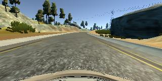
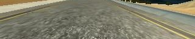

# Behavioral Cloning Project


Overview
---

The project "Behavioral Cloning" is based on the idea of end-to-end learning of an autonomous vehicle. It means that input
to the vehicle is the data from sensors (which in this case are three front cameras placed in the center, left and right side
of the vehicle). The training data is gathered from a simulation environment. The output of the simulation are the images from 
the center, left and right cameras as well as steering corresponding steering angle and speed. For the purpose of this project,
only the steering angle is of interest. Based on the training data i.e. scenarios and the steering angle in that particular
scenario, the network learns to predict a correct steering angle for each situation. The goal is to keep the car on the drivable
track in the autonomous driving mode. The main idea behind it is, in contrast to other approaches, that not only perception, but
also interpretation, motion planning and control part is also learned by the vehicle. In essence, between the part between sensor
input data and the steering commands is a black-box.

The goals / steps of this project are the following:
* Use the simulator to collect data of good driving behavior
* Build, a convolution neural network in Keras that predicts steering angles from images
* Train and validate the model with a training and validation set
* Test that the model successfully drives around track one without leaving the road
* Summarize the results with a written report

Model Architecture and Training Strategy
---

### Selection of Appropriate Model
The convolutional neural network used for this project is a network published by NVIDIA. This network is designed for the 
End-to-End deep learning for self driving cars. More details about this network can be found [here](https://devblogs.nvidia.com/deep-learning-self-driving-cars/).

This network consists of 9 layers, including a normalization layer, 5 convolutional layers, and 3 fully connected layers, as shown
in the figure below:


Source: https://devblogs.nvidia.com/deep-learning-self-driving-cars/

The model in the code as shown in the above figure can be found between lines 106 and 116.

```
model.add(Convolution2D(24,5,5, subsample=(2,2), activation="relu"))
model.add(Convolution2D(36,5,5, subsample=(2,2), activation="relu"))
model.add(Convolution2D(48,5,5, subsample=(2,2), activation="relu"))
model.add(Convolution2D(64,3,3, activation="relu"))
model.add(Convolution2D(64,3,3, activation="relu"))
model.add(Flatten())
model.add(Dense(100))
model.add(Dropout(0.5))
model.add(Dense(50))
model.add(Dense(10))
model.add(Dense(1))
```

To introduce non linearity to the model, ReLU activation is used.

### Normalization and Pre-Processing

In the model python file [bcn_model.py](bcn_model.py), line 103 is where the normalization takes place. Additionally, training
data is augmented by using a few techniques which are discussed below.

```
model.add(Lambda(lambda x: x/255.0-0.5, input_shape=(160,320,3)))
```

The input images are normalized between -0.5 and +0.5. Additionally, 2D cropping is also done.

```
model.add(Cropping2D(cropping=((70,25),(0,0))))
```

From the top of the image, 70 pixels and from the bottom, 25 pixels are removed horizontally. This is done so that the network
does not get distracted by unnecessary objects in the scene and the focus of learning remains on the track. Below, an example is shown.

Uncropped Center Camera Image            |  Cropped Image for Network Training |
:---------------------------------------:|:------------------------------------:
| |  |

### Measures Against Over-fitting

 The data collected from simulation is divided into training (80%) and validation (20%) sets. It can be seen on line 19:

```
train_samples, validation_samples = train_test_split(samples, test_size=0.2)
```

The model was tested by running it through the simulator and ensuring that the vehicle could stay on the track. Furthermore,
in order to avoid over-fitting, a dropout layer is introduced with a keep probability of 50%.

### Parameter Tuning

In the model, Adam optimizer is used. The learning rate of 0.0005 is found to be appropriate.

### Training Data

In the first step, data is collected by driving 4 laps in the clockwise direction in the simulation track. Testing in the autonomous
mode showed mostly satisfactory performance on the straight parts of the track. The performance at the curves was bad. At most of the curves,
the vehicle would jump off the track.

To improve the performance further, 2 laps of driving in the counter clock-wise direction are added. This improved the performance
on the straight parts of the track very significantly. The performance on the curves was still poor.

As a third step, more data was collected only on the curves. This improved the performance on the curves and the vehicle stayed on
track all the time.

### Training Data Augmentation

The training data is augmented by flipping the images from the center camera. The corresponding steering angle measurements are also
inverted. Moreover, the images from the left and right cameras are also used. This required the correction of the steering angle
by a factor to compensate for the distance of the side cameras from the center. The data augmentation part can be found in the code between
lines 55 to 80.

```
# Augmenting center camera data by flipping the images and appending
# to the images array
image_center_flipped = np.fliplr(image_center)
images.append(image_center)
images.append(image_center_flipped)
images.append(image_left)
images.append(image_right)

# Steering angle from the perspective of the center camera is read directly
measurement_center = float(line[3])
    
# Steering angle from the perspecitve of the left and right cameras must be
# corrected with a factor. The factor is tunable
correction_factor = 0.2
measurement_left = measurement_center + correction_factor
measurement_right = measurement_center - correction_factor
   
# Like the image, the steering angle corresponding to the flipped center
# image must also be corrected
measurement_center_flipped = -measurement_center
    
# All the measurements are appened to the measurements array
measurements.append(measurement_center)
measurements.append(measurement_center_flipped)
measurements.append(measurement_left)
measurements.append(measurement_right)
```

### Result Video

The result video can be found [here](video.py). At two places, the vehicle drives shortly over a lanes. This can be mitigated
with further training.

### Conclusion

Thís project provides a good insight into the end-to-end learning for autonomous vehicles. Although, the
data used is from a simulation and also tested in a simulation, the overarching principles for the real world remain the same.

By doing this project, the importance of the quantity as well as quality of data required for the task of automation
becomes more evident, as the simulation environment is very simple with no other objects on the road and only one parameter, the steering
angle, to be predicted. In the real world, in the presence of objects (vehicles, pedestrians, traffic lights, road signs, exits and entries),
as well as many more parameters to control under different weather conditions, with the consideration of safety requirements,
the amount and quality of required data to train a network will increase exponentially.